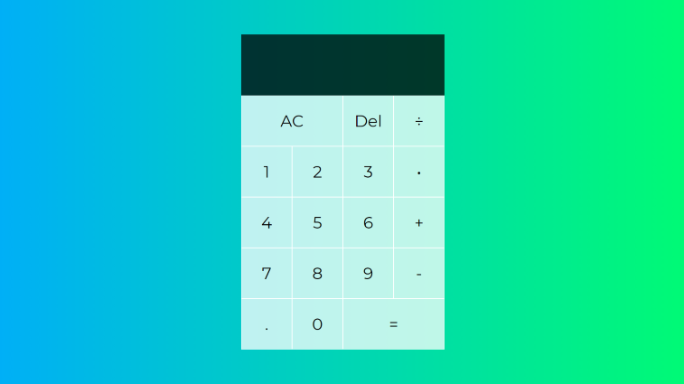
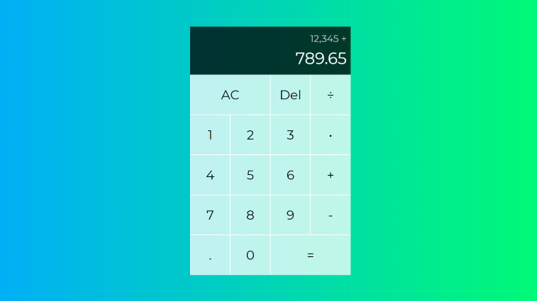

# [simple calculator](https://theineptdev.github.io/simple-calculator/)

A simple, web-based, calculator. Built by following [Web Dev Simplified](https://www.youtube.com/channel/UCFbNIlppjAuEX4znoulh0Cw)'s [JavaScript calculator tutorial](https://www.youtube.com/watch?v=j59qQ7YWLxw&ab_channel=WebDevSimplified). 

Created to refresh my JavaScript skillset while also familiarizing myself with how others use the language.

# Screenshots

  
  

# Technology

Created with JavaScript, HTML, and CSS.
